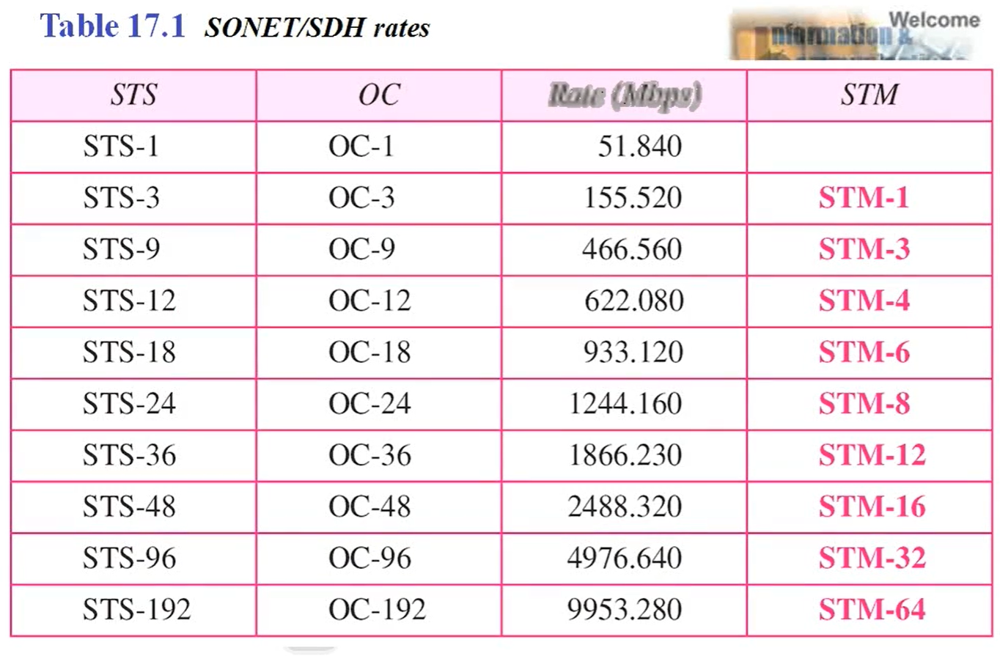
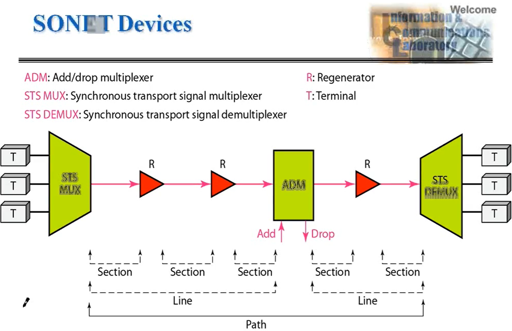
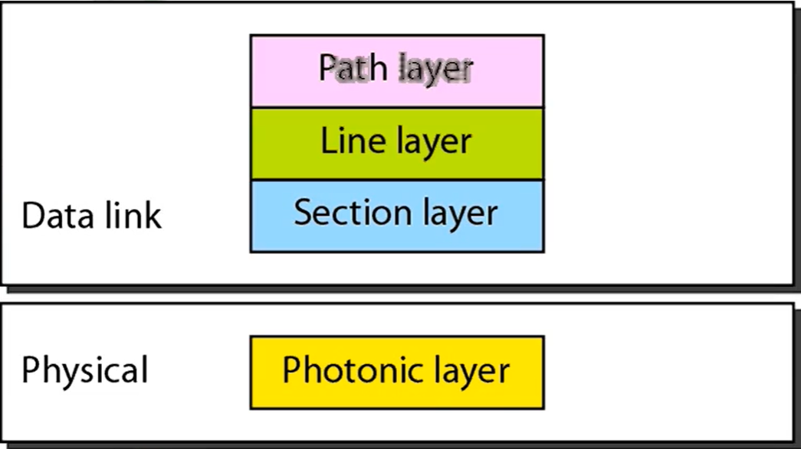
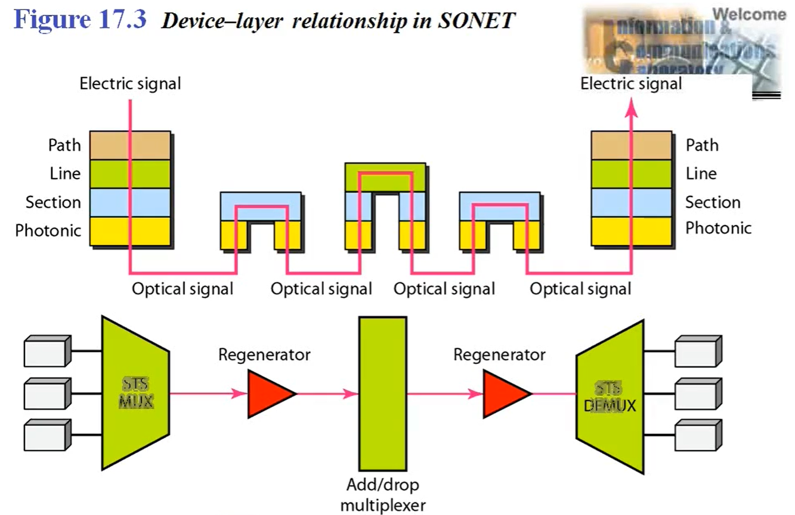
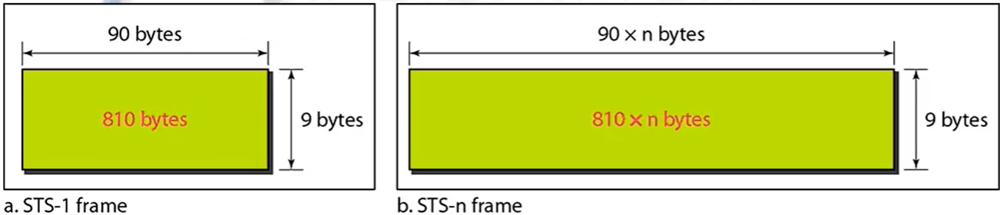
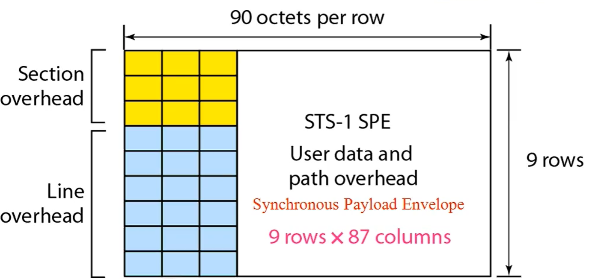
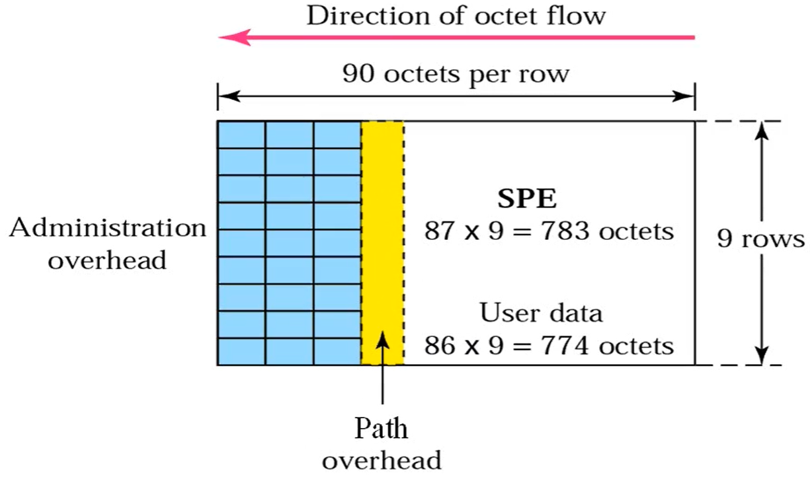
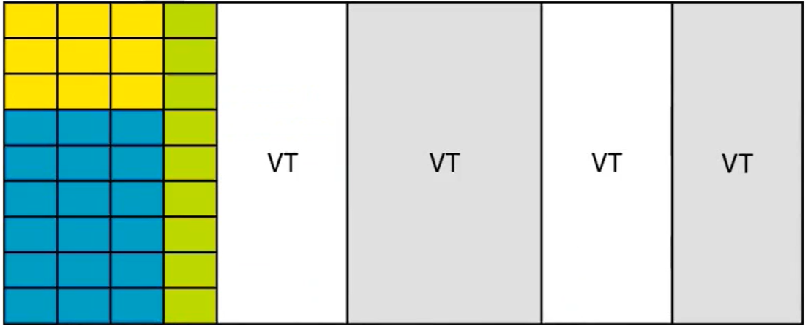
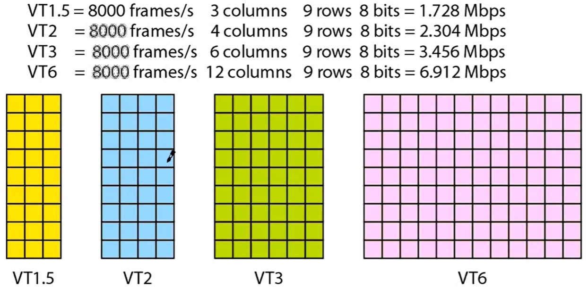

# SONET/SDH

> 광 전송 시스템

> - SONET 미국 표준 (Synchronous Optical Network)
> - SDH 유럽 표준 (Synchronous Digital Hierarchy)

- SONET/SDH는 synchronous network
  - 하나의 clock을 사용해서 전송 타이밍을 조절
    - clock : 특정 신호를 몇 초 동안 유지할 것인지 결정하는 기준

## Architecture (signals, devices, and connections)

- SONET은 <u>Synchronous Transport Signals (STSs)</u>라는 전기 신호 위계를 정의
  - **STSs는 SONET에서 기본 단위의 frame**, (= frame format)

- 이 frame을 어떻게 광신호를 보낼까를 말하는 것이 <u>Optical Carriers (OCs)</u>

- SDH에서는 STSs의 역할을 하는 것이 <u>Synchronous Transport Module (STM)</u>

`가장 중요한 표!!` <u>외워야 함</u>

- STS - OC의 숫자는 대응됨

  - 이 숫자는 Rate의 비율과도 같음

  - <u>**이 속도를 외워야 함**</u>

- STS-3를 사용한다 = OC-3를 사용한다 = STM-1을 사용한다 = 155.5 Mbps 속도를 사용한다

### SONET의 구성

- SONET 전송은 3가지 devices로 구성

  1. STS multiplexers / demultiplexers
  2. regenerators
  3. `add/drop multiplexers`

  - 여기다가 terminal 이 추가

- STS MUX / DEMUX : 광 네트워크와 전기 네트워크 사이의 인터페이스 제공
- Regenerators : link(cable)의 길이를 늘여줌 (빛을 다시 쏴 주는 기능)

- `ADM` : 신호의 삽입 / 추출을 담당

### SONET layers

- **section layer** : 장비들 간 연결
- **line layer** : mux 간 연결
- **path layer** : end-to-end 연결

- SONET은 NRZ encoding을 사용
  - NRZ encoding이란? `빛을 쏘면 1, 빛을 안 쏘면 0 으로 encoding`

### SONET frames

- 각 STS는 8000 프레임으로 구성
- 각 프레임은 2차원으로 구성 (**9 row** X **90*n columns**)

- 각 STS 신호는 초당 8000 프레임을 전송

### STS-1 frame format

- section에서 주고 받는 정보, line에서 주고 받는 정보, path에서 주고 받는 정보로 이루어짐
  - path data는 1 row임 (크기가 커서 여러개 같지만 사실 한 줄짜리)
  - 나머지 부분이 사용자 데이터

- (참고) MUX 동작 원리

## Virtual Tributaries

> STS-1 보다 작은 속도를 어떻게 SONET으로 지원할 것인가? => VT로 해결

- SONET이 기존의 속도를 지워하기 위해 사용하는 방법

- **VT1.5** (aka **T1**) - 1.544 Mbps
- **VT2** (aka **E1**) - 2.048 Mbps
- **VT3** - 3.152 Mbps
- **VT6** - 6.312 Mbps

[구성]

