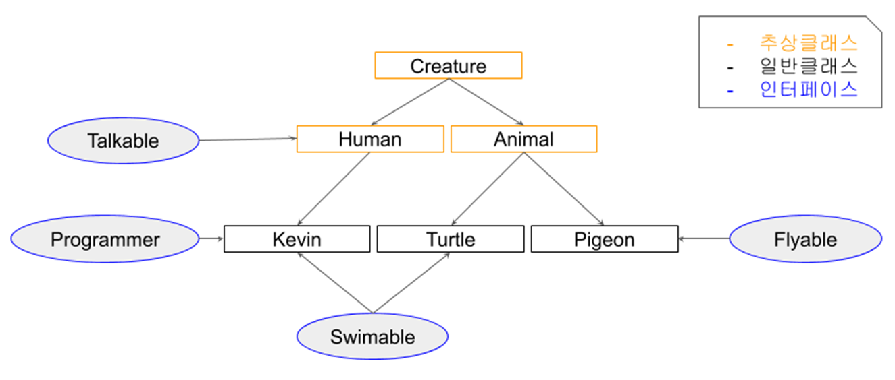

# Java

## JAVA의 특징?

- 객체지향 프로그래밍 언어
- 기본 자료형을 제외한 모든 요소들이 **객체**로 표현
- **캡슐화, 상속, 다형성**이 잘 적용된 언어
- JVM 위에서 동작하기 때문에 운영체제에 독립적
- GabageCollector를 통한 자동적인 메모리 관리
- 다중 상속이나 타입에 엄격하며, 제약이 많다

## JVM?

- **Java Byte Code를 OS에 맞게 해석 해주는 역할**
    - .java → .class 근데 .class는 기계어가 아니라 JVM이 번역해야 함
- **가비지컬렉션**을 통해 자동적인 메모리 관리

### 동작과정

1. java 파일
2. class 파일로 컴파일
3. Class Loader가 class 파일을 JVM의 메모리로 Load
4. JVM이 class 파일을 기계어로 해석

### GC?

- JVM의 메모리 관리 기법
- JVM이 APP을 멈추고 GC 작업 후 APP 재개

## 메모리 영역?

- **메서드**
    - JVM 동작 후 클래스 로딩 때 생성

**static 변수,** **전역 변수**, 코드에서 사용되는 **클래스 정보**들이 올라갑니다.

코드에서 사용되는 클래스들을 로더가 읽고 클래스 별로 분류해서 저장합니다.

- **스택(Stack)**
    - 런타임 중 생성

**지역 변수, 메서드** 등이 할당되는 LIFO 방식의 메모리입니다.

- **힙(Heap)**
    - 컴파일 중 생성

**new 연산자를 통해 동적 할당된 객체들이 저장**되고 메모리는 가비지 컬렉션에 의해 관리됩니다.

## 타입?

### 원시타입?

- 정수형 byte, short, int, long
- 실수형 float, double
- 문자형 char
- 논리형 boolean

### Wrapper 클래스

객체로 취급하는 데이터

**Byte, Short, Integer, Long, Float, Double, Character, Boolean**

- Boxing : 원시타입 → Wrapper 클래스
    - new Integer(n)
- Unboxing : Wrapper 클래스 → 원시타입
    - N.intValue()

## OOP

**데이터를 객체로 취급**하여 프로그래밍하는 것

이전의 절차적 프로그래밍과 다르게 **객체 간 상호작용을 통해 프로그램이 동작**

### 특징?

- 캡슐화
- 상속
- 다형성
- 추상화 : 클래스 정의를 통해 공통적인 속성과 기능을 묶음

### SOLID?

로버트 마틴의 OOP 설계 원칙

- SRP
- OCP
- LSP : 부모는 자식으로 대체 가능
- ISP : 인터페이스는 잘게 분리 (안 쓰는 기능이 들어가면 안 됨)
- DIP : 상위 모듈이 하위 모듈에 종속성을 가지면 안 됨

## static?

- static
    - 공간적 특성: **멤버는 클래스당 하나가 생성**
        - 멤버는 객체 내부가 아닌 별도의 공간에 생성
        - ***클래스 멤버*** 라고 부른다
    - 시간적 특성: **클래스 로딩 시에 멤버가 생성**
        - 객체가 생기기 전에 이미 생성
        - 객체가 생기기 전에도 사용이 가능 (즉, 객체를 생성하지 않고도 사용할 수 있다.)
        - 객체가 사라져도 멤버는 사라지지 않음
        - 멤버는 프로그램이 종료될 때 사라짐
    - 공유의 특성: **동일한 클래스의 모든 객체들에 의해 공유**
- non-static
    - 공간적 특성: **멤버는 객체마다 별도로 존재**
        - ***인스턴스 멤버*** 라고 부른다
    - 시간적 특성: **객체 생성 시에 멤버가 생성**
        - 객체가 생길 때 멤버도 생성
        - 객체 생성 후 멤버 사용이 가능
        - 객체가 사라지면 멤버도 사라짐
    - 공유의 특성: **공유되지 않음**
        - 멤버는 객체 내에 각각의 공간을 유지
        

`main()이 static인 이유`

⇒ JVM에서 처음 시작되기 때문에 미리 메모리에 로드되어 있어야 한다.

## final?

변경 불가능하게 만듦

→ 값에 대한 신뢰성을 높여 동기화 고려할 필요 X, 일정한 값을 보장, GC 대상이 아니라 효율 상성

## 접근 제어자?

- public : 모두
- private : 나만
- protected : 친구와 자식만 (동일 패키지, 자식 클래스)

## Collection?

- List
    - ArrayList, LinkedList
- Map
    - HashMap, LinkedHashMap(순서)
- Set
    - HashSet, LinkedHashSet(순서)
- Stack & Queue
    - Stack, LinkedList

### Generic

Collection의 객체 타입 체크

## 추상 클래스 vs 인터페이스?

- 추상 클래스
    - **is**
    - 추상 메서드를 하나 이상 가진 클래스
    - 상속
- 인터페이스
    - **has**
    - 추상 메서드와 상수만 멤버
    - 합성(컴포지션)

## POJO?

Plain Old Java Object

특정한 자바 모델이나 기능, 프레임워크 등을 따르지 않는 자바 오브젝트

## 멤버 변수 초기화 순서

1. static 변수 선언
    - 클래스가 로드될 때
2. Field 변수 선언 (전역 변수)
    - 객체가 생성될 때
    - Heap Memory
3. 생성자 Block
    - Field 변수 초기화 이후
    - 객체가 생성될 때
    - Heap Memory

## Reflection

런타임 상황에서 메모리에 올라간 클래스나 메서드 등의 정의를 동적으로 찾아 조작할 수 있는 행위

## 직렬화

입출력에 Stream이라는 데이터 통로를 사용

이 통로를 지나기 위해 객체를 바이트 배열로 변환

반대로 스트림으로 받은 바이트 배열을 객체로 바꾸는 건 역직렬화

## 동기화 방법?

`synchronized`, `ThreadLocal`로 동기화 가능

## Error vs Exception?

- Error : 실행 중 일어나는 치명적 오류 / 발생 시 비정상 종료
- Exception : 경미한 오류 / try-catch로 넘길 수 있음

## == vs equals()

- == : reference 비교
- equals() : content 비교