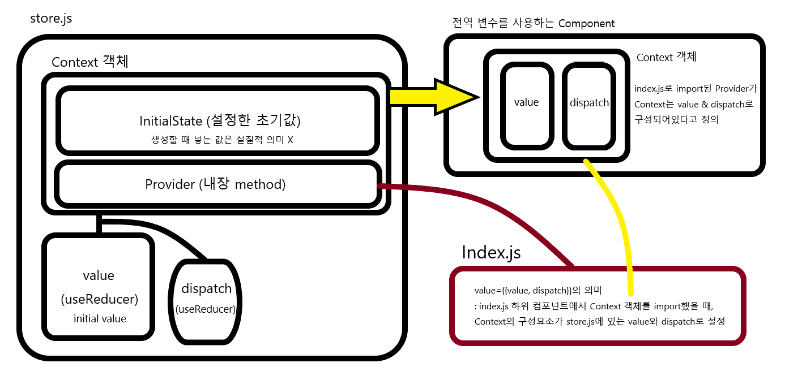

# React Global State Management Without Redux

Redux를 사용하지 않고 Context API와 useReducer Hook을 활용한 전역 상태 관리

> 굉장히 많은 시행착오를 거친 결과
>
> 참조 링크 : [https://velog.io/@kimu2370/%EB%A6%AC%EB%8D%95%EC%8A%A4%EC%97%86%EC%9D%B4-%EC%83%81%ED%83%9C-%EA%B4%80%EB%A6%AC%ED%95%98%EA%B8%B0hookscontext](https://velog.io/@kimu2370/리덕스없이-상태-관리하기hookscontext)

## 배경

[개념]

- Context : 기존의 Props 방식을 대체 (Props Drilling 문제 해결) => 상위 컴포넌트의 State를 하위 컴포넌트로 직접 전달 (props를 계속 할 필요 X)
- Reducer : Redux의 Reducer와 같은 역할 / State와 Action을 인자로 받아 Action Type 별로 State를 변경


[메서드]

- `createContext` : Context 객체 생성 => 이렇게 만들어진 Context 객체에는 Context를 사용할 하위 컴포넌트를 태깅하는 Provider 태그 제공
  
  - `Provider` : `<Provider value={값}> </Provider>` 형태로 하위 컴포넌트에서  Context의 초기 값을 개별 설정 가능
  
- `useContext` : Context 객체 사용 => createContext로 생성한 Context 객체를 사용하겠다고 선언

- `useReducer` : Reducer를 연동시킨 State와 Dispatch 생성 (useState와 비슷한 역할 ; Context 값 변경)

  => `[state, dispatch] = useReducer(reducer, initialState)`


```
요약
- createContext : Context 객체 생성
- useContext : Context 객체 사용
- useReducer : Context 객체 수정
```


### 문제점

공식 문서대로 만들면 Context는 전역 관리 가능 (상위 컴포넌트에서 하위 컴포넌트로 Context를 뿌려주는 용도이기 때문)

하지만 useReducer를 각 Component 마다 만들어서 관리해야 함 (Context를 사용하는 하위 컴포넌트에서 Context 값을 바꾸는 용도이기 때문)

### 해결법

1. store.js에서 context, reducer를 다 만듦
2. 만들어진 context에서 Provider 분리
3. useReducer를 사용해서 context 객체 내부에 넣을 value와 dispatch 생성
4. <u>useReducer로 만들어진</u>, <u>value와 dispatch를 넣은</u>, <u>context 객체를 전달하는</u> Provider 생성
5. export
   1. store : 전역 변수를 사용할 컴포넌트에서 가져가서 전역 변수 value와 value를 수정하는 dispatch 사용
   2. StateProvider : index.js에서 가져가서 store.js를 모든 컴포넌트에서 사용할 수 있게 설정


## 정리



1. createContext로 **Context 객체** 생성
2. useReducer로 **value**와 value를 업데이트할 수 있는 reducer가 연결된 **dispatch** 생성
3. index.js에 Provider를 전달하면서, index.js의 하위 컴포넌트는  Context 객체를 **value**와 **dispatch**로 구성되어 있다고 정의
4. 각 컴포넌트에서 store.js에서 Context 객체를 가져오고 안에있는 value와 value를 바꿀 수 있는 dispatch 사용


## 예시 코드

[Setting Part]

1. Store.js <u>생성</u>

   ```react
   // Store.js
   import React, {createContext, useReducer} from "react";
   
   // Store - (1) 초기값 설정 *****
   const initialState = {a: "초기화", gameList: []};
   // Store - (2) 초기값을 넣은 Context 생성 // 나중에 5번에서 다시 초기값을 넣어줘서 사실 초기값 넣을 필요 없음 *****
   const store = createContext(initialState);
   // Store - (3) 위의 Context와 관련된 Provider 생성 : Index.js 용도 (모든 컴포넌트에서 Store 접근 가능하게 만드는 역할)
   const {Provider} = store;
   
   // Store - (4) 위에서 만든 Provider를 Return하는 React Component : React 관련 내용물은 항상 React Component 형식이 필요
   const StateProvider = ({children}) => {
     // Store - (5) useReducer를 사용해 value와 value를 업데이트하는 dispatch 생성 *****
     const [value, dispatch] = useReducer((state,action)=>{
       switch(action.type) {
         case 'TEST':
           const newState = {b: "업데이트"}
           return {...state, ...newState};
         case 'GET_GAME_LIST':
           const gameList = action.value
           return {...state, gameList};
         default:
           throw new Error();
       };
     },initialState);
     
     // Store - (6) Context의 Return 형식 (Context는 항상 이렇게 내려보내야 해서 Provider 형식으로 Return 해 줌)
     return <Provider value={{value,dispatch}}>{children}</Provider>;
   }
   
   export {store, StateProvider}
   ```

   

2. Index.js 에 StateProvider 적용 => 전역에서 store.js에 접근 <u>허용</u>

   ```react
   import React from 'react';
   import ReactDOM from 'react-dom';
   import './index.css';
   import App from './App';
   import { StateProvider } from "store/store.js"
   
   ReactDOM.render(
     <React.StrictMode>
       <StateProvider>
         <App />
       </StateProvider>
     </React.StrictMode>,
     document.getElementById('root')
   );
   ```


[Use Part]

3. 전역 변수 사용 (컴포넌트 별로 store를 import 해야 함)

   1. Component_1 => dispatch를 이용해 Reducer 실행 => 전역 변수 **변경**

      ```react
      import React, { useContext, useEffect } from "react"; // useContext import *****
      import "./MainPage.css";
      import DateCarousel from "components/game/player/Main__DateCarousel.js";
      import PreferredArea from "components/game/player/Main__PreferredArea.js";
      import GameList from "components/game/player/Main__GameList.js";
      import { store } from 'store/store.js'; // store import *****
      import gameListDummy from "store/gameListDummy.js"
      
      function MainPage() {
        // Component_1 - (1) store에서 가져온 store Context를 globalState 변수에 집어넣음 *****
        const globalState = useContext(store);
        console.log('1', globalState.value) // globalState 확인
        // Component_1 - (2) globalState에서 전역 변수 value를 업데이트하는 dispatch만 가져오기 *****
        const { dispatch } = globalState;
      
        useEffect(()=>{
          // Component_1 - (3) 위에서 가져온 dipatch를 이용해서 reducer 실행 => 전역 변수 value 업데이트 *****
          /* useEffect를 사용하는 이유
          dispatch로 value를 업데이트하면 관련 컴포넌트 Rerendering
          => MainPage 함수가 다시 실행되면서 useEffect 바깥에 있는 코드가 전부 재실행됨
          이 때 dispatch가 바깥에 있으면. dispatch 재귀적 무한 실행 & 무한 렌더링으로 에러 발생 */
          dispatch({ type: 'TEST' })
          dispatch({ type: 'GET_GAME_LIST', value: gameListDummy}) // globalState 변경
          console.log('2', globalState.value) // 여기서는 변경점이 아직 적용 X
        },[])
      
        return(
          <div className="main">
            <store.Provider value={globalState}>
              <div className="main__dates"><DateCarousel /></div>
              <div className="main__areas"><PreferredArea /></div>
              <div className="main__games"><GameList /></div>
            </store.Provider>
          </div>
        );
      }
      
      export default MainPage;
      ```

   2. Component_2 => 변경점 **확인**

      ```react
      import React, { useContext } from "react";
      import "./Main__GameList.css"
      import { store } from 'store/store.js';
      
      export default function Main__GameList() {
        // Component_2 - (1) 다른 컴포넌트에서 업데이트 한 State 변경 확인
        const globalState = useContext(store);
        console.log('3', globalState.value)
        const gameData = globalState.value.gameList
        console.log(gameData) // globalState 변경 적용 확인
      
        return(
          <div className="main__gameList">
            <hr></hr>
            <div className="gameList__List">
              { gameData.map((game)=>(
                <div className="gameList__game" key={game.id}>
                  <div className="gameList__content">
      
                    <div className="gameList__game__Time">
                      {game.start_time.substr(0,2)+" : "+game.start_time.substr(2,4)}<br />~ {game.end_time.substr(0,2)+" : "+game.end_time.substr(2,4)}
                    </div>
      
                    <div className="gameList__game__info">
                      <div className="gameList__game__name">
                        {game.name}
                      </div>
                      <div className="gameList__game__location">
                        {game.City + " " + game.Area + " | 코트 규격: " + game.court_length + " * " + game.court_width}
                      </div>
                      <div className="gameList__game__personnel">
                        {"최소인원: " + game.min_people + " | 최대인원: " + game.max_people}
                      </div>
                    </div>
      
                    <div className="gameList__game__facility">
                      {game.is_parking ? <div>주차장</div>:""}
                      {game.is_shower ? <div>샤워시설</div>:""}
                      {game.is_airconditional ? <div>에어컨</div>:""}
                      {game.is_basketball ? <div>농구공 대여</div>:""}
                      {game.is_scoreboard ? <div>점수판&호루라기</div>:""}
                      {game.is_water ? <div>정수기</div>:""}
                    </div>
      
                    <div className="gameList__game__state">
                      <button>참여하기</button>
                    </div>
                  </div>
                  <hr></hr>
                </div>
              ))}
            </div>
          </div>
        )
      }
      ```