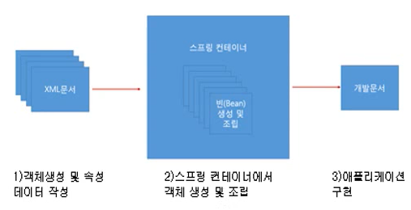

# 스프링 개요

JAVA / JSP 필수

## 스프링 프레임워크란?

[주요기능]

- DI : 의존성 주입
- AOP : (관점 지향 프로그래밍) 주요 부분만 작업
- MVC
- JDBC : JAVA를 통해 DB에 통신

## 스프링 프레임워크 모듈

| 스프링 모듈   | 기능                                                         |
| ------------- | ------------------------------------------------------------ |
| spring-core   | 스프링의 **핵심인 DI(Dependency Injection)와 IoC(Inversion of Control)를 제공** |
| spring-aop    | **AOP** 구현 기능 제공                                       |
| spring-jdbc   | **데이터베이스**를 적은 양의 코드로 다룰 수 있는 기능 제공   |
| spring-tx     | 스프링에서 제공하는 트랜잭션 관련 기능 제공                  |
| spring-webmvc | 스프링에서 제공하는 컨트롤러(Controller)와 뷰(View)를 이용한 스프링 **MVC** 구현 기능 제공 |

- 모듈을 사용하려면, 모듈에 대한 의존설정을 XML 파일 등을 이용해 개발자가 직접 설정하면 된다.

## 스프링 컨테이너 (IoC)

- 스프링에서 객체를 생성하고 조립하는 컨테이너(Container)
- 컨테이너를 통해 생성된 객체를 빈(Bean)이라고 부른다

1. XML 문서를 이용해서, 객체 생성 및 속성 데이터 작성
2. 스프링 컨테이너가 객체(Bean)를 생성
3. JAVA 문서에서 컨테이너 안의 필요한 기능을 꺼내서 사용

**스프링에서는 new를 이용해서 객체를 생성하지 않고 컨테이너를 통해서 Bean을 사용**

> 참고 : https://private.tistory.com/39