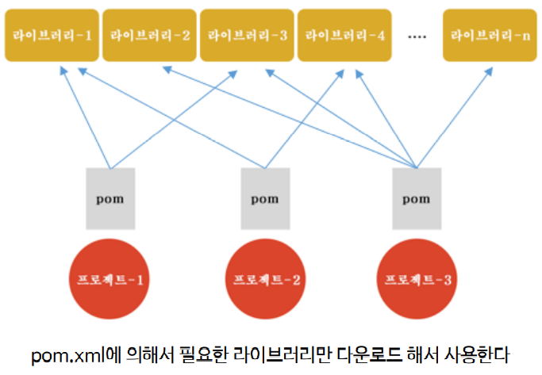

# 스프링 프로젝트 생성

## 프로젝트 생성

1. New- Project
2. Maven 검색 - Maven Project

3. Create Simple project, use default Workspace location 체크
4. Group ID(큰 프로젝트), artifact ID(프로젝트 내 모듈 프로젝트)


## pom.xml

이렇게 프로젝트를 생성하면 pom.xml이 생성된다

<u>pom.xml은 스프링 프로젝트에서 사용할 **모듈을 가져오는 파일**</u>


- <dependencies> 어떤 모듈에 의존하는지
- <build> build와 관련된 내용


직접 타이핑해도 되지만, 강의에서는 import를 사용

=> Package Explorer에서 `Import` => maven 검색 => `Existing Maven Projects` => 강의자료 import


```xml
<?xml version="1.0" encoding="UTF-8"?>
<project xmlns="http://maven.apache.org/POM/4.0.0" xmlns:xsi="http://www.w3.org/2001/XMLSchema-instance"
	xsi:schemaLocation="http://maven.apache.org/POM/4.0.0 
		http://maven.apache.org/xsd/maven-4.0.0.xsd">
	<modelVersion>4.0.0</modelVersion>
	<groupId>spring4</groupId>
	<artifactId>ch02_pjt_01</artifactId>
	<version>0.0.1-SNAPSHOT</version>

	<dependencies>
		<dependency>
			<groupId>org.springframework</groupId>
			<artifactId>spring-context</artifactId>
			<version>4.1.0.RELEASE</version>
		</dependency>

	</dependencies>


	<build>
		<plugins>
			<plugin>
				<artifactId>maven-compiler-plugin</artifactId>
				<version>3.1</version>
				<configuration>
					<source>1.8</source>
					<target>1.8</target>
					<encoding>utf-8</encoding>
				</configuration>
			</plugin>
		</plugins>
	</build>


</project>
```


- 메이븐 설정파일에 명시된 버전과 JRE 라이브러리 버전이 일치하지 않을 때는, `프로젝트` - `Maven` - `Update Project`를 통해 업데이트 진행




pom.xml 파일은 `메이븐 설정파일`, 메이븐은 <u>라이브러리를 연결하고 빌드를 위한 플랫폼</u>