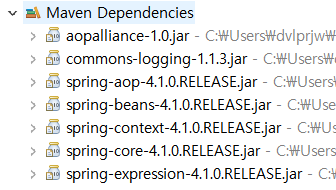

# 처음 해 보는 스프링 프로젝트

## Setting

[폰트]

window - preferences - general - apearance - colors and font -text font - 나눔고딕 코딩


[pom.xml]

```xml
<project xmlns="http://maven.apache.org/POM/4.0.0" xmlns:xsi="http://www.w3.org/2001/XMLSchema-instance" xsi:schemaLocation="http://maven.apache.org/POM/4.0.0  http://maven.apache.org/xsd/maven-4.0.0.xsd">
	<modelVersion>4.0.0</modelVersion>
	<groupId>spring1</groupId>
	<artifactId>Spring1_lec04</artifactId>
	<version>0.0.1-SNAPSHOT</version>

	<dependencies>
		<dependency>
			<groupId>org.springframework</groupId>
			<artifactId>spring-context</artifactId>
			<version>4.1.0.RELEASE</version>
		</dependency>

	</dependencies>


	<build>
		<plugins>
			<plugin>
				<artifactId>maven-compiler-plugin</artifactId>
				<version>3.1</version>
				<configuration>
					<source>1.8</source>
					<target>1.8</target>
					<encoding>utf-8</encoding>
				</configuration>
			</plugin>
		</plugins>
	</build>
	
</project>
```

- dependencies : 필요한 모듈들을 적는 곳

  위의 경우 org.springframework 그룹의 spring-context 라이브러리를 가져오는 것

  

  이렇게 라이브러리가 생성됨


- build : 프로젝트가 build될 때 필요한 명령들 명시


## Class 생성

1. TransportationWalk.java

   ```java
   package testPjt;
   
   public class TransportationWalk {
   
   		public void move() {
   			System.out.println("도보로 이동 합니다.");
   		}
   }
   ```

2. MainClass.java

   ```java
   package testPjt;
   
   public class MainClass {
   
   	public static void main(String[] args) {
   		
   		TransportationWalk transportationWalk = new TransportationWalk();
   		transportationWalk.move();
   		
   	}
   }
   ```


main이 존재하는 MainClass를 실행시키면 TransportationWalk 클래스를 불러와서 move 함수를 실행시킨다 (동일 패키지에서는 따로 import가 필요 X)


**!!!!!그런데!!!!!**

**스프링에서는 <u>컨테이너</u>를 통해 <u>객체</u>(Bean)를 생성하고 조립한다고 했다**

그리고 컨테이너는 XML 문서를 통해 조작할 수 있다고 했다

=> src/main/resources의 `applicationContext.xml`이 바로 그 XML


이렇게 하면 new를 통해 객체를 생성할 필요가 없다


### applicationContext.xml (꼭 이 이름일 필요는 없다)

1. src/main/resources - new - other - xml 검색 - XML File - 이름은 자유롭게 - 생성 (화면이 이상하면 Design -> Source 탭으로 바꾼다)

2. 코드 복사

   beans 부분은 <u>항상 코드가 똑같기 때문에</u> 오타 위험이 있는 타이핑보다 복사를 통해 재활용

   bean 태그는 프로젝트에 맞게 고쳐야 함

   id는 이름을 정한다고 생각하고 짓고, class는 어디있는 class를 통해서 bean을 만들것인지 명시

   ```xml
   <?xml version="1.0" encoding="UTF-8"?>
   
   <beans xsi:schemaLocation="http://www.springframework.org/schema/beans http://www.springframework.org/schema/beans/spring-beans.xsd" xmlns:xsi="http://www.w3.org/2001/XMLSchema-instance" xmlns="http://www.springframework.org/schema/beans">
   
   	<bean id="tWalk" class="testPjt.TransportationWalk" />
   
   </beans>
   ```

   `<bean id="tWalk" class="testPjt.TransportationWalk" />` 이렇게 쓰면 new 없이 객체 생성 가능


바뀐 코드

```java
package testPjt;

import org.springframework.context.support.GenericXmlApplicationContext;

public class MainClass {

	public static void main(String[] args) {
		
		GenericXmlApplicationContext ctx = new GenericXmlApplicationContext("classpath:applicationContext.xml"); // 컨테이너 생성
		
		TransportationWalk transportationWalk = ctx.getBean("tWalk", TransportationWalk.class); // 해당 컨테이너에서 선택한 빈을 생성
		transportationWalk.move();
		
		ctx.close(); // 외부 리소스를 사용한 이후에는 반환
		
	}
}
```

