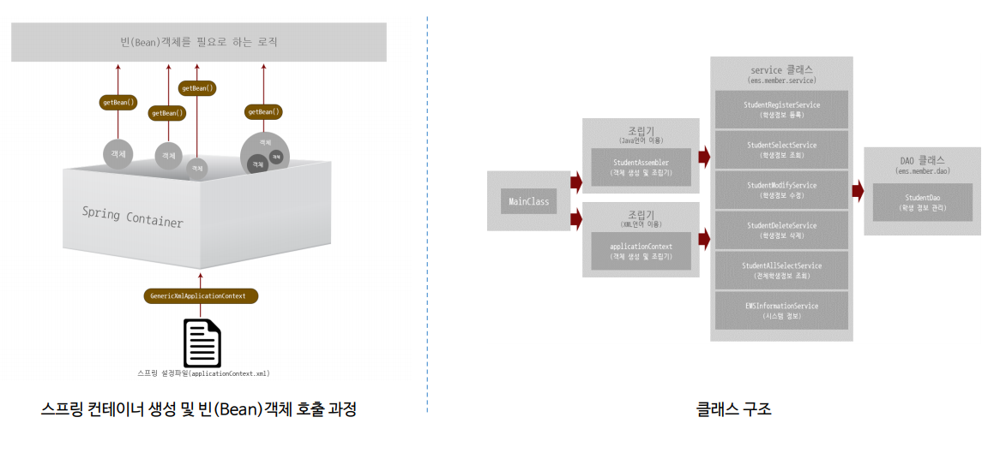

# Dependency Injection

## Dependency Injection란?

- 예시
  - 배터리 일체형
  - **배터리 분리형** <- <u>Dependency Injection</u>

- **객체를 분리**
- 분리된 여러 객체들에 의존해서 완성 => 의존성을 주입 => 완성

```java
public class ElectronicRobotToy {
    private Battery battery;
    
    public ElectronicRobotToy() {
        this.battery = battery;
    }
    
    public void setBettery(Battery battery) {
        this.battery = battery;
    }
}
```

=> battery를 Toy에서 분리 / setBettery를 통해서 언제든지 battery 교체 가능


## Spring에서의 DI



- 설정파일 - GenericXmlApplicationContext를 통해 `Container 생성` => `Bean 객체 생성` => Bean을 이용한 `로직 생성`
  - <u>이 때, 객체는 내부에 다른 객체가 들어있을 수 있다. 즉 의존성이 주입될 수 있다.</u>


## 예시

- main - MainClass

```java
package ems.member.main;

import java.util.Iterator;
import java.util.Map;
import java.util.Scanner;
import java.util.Set;

import ems.member.Student;
import ems.member.assembler.StudentAssembler;
import ems.member.service.StudentAllSelectService;
import ems.member.service.StudentModifyService;
import ems.member.service.StudentRegisterService;
import ems.member.service.StudentSelectService;

public class MainClass {

	public static void main(String[] args) {
		
		String[] sNums = {"H39r8djakndfae32", "H39asdfaelu42o23", "H39iiemamca8w9h4", 
						  "H39lkmn754fghia7", "H39plo865cuy8k92", "H39mnbviiaed89q1", 
						  "H399omjjyv56t3d5", "H39lczaqwg644gj8", "H39ymbcsh74thgh2", 
						  "H39lesvj7544vf89"};
		
		String[] sIds = {"rabbit", "hippo", "raccoon", "elephant", "lion", 
					    "tiger", "pig", "horse", "bird", "deer"};
		
		String[] sPws = {"96539", "94875", "15284", "48765", "28661", 
						"60915", "30028", "29801", "28645", "28465"};
		
		String[] sNames = {"agatha", "barbara", "chris", "doris", "elva", 
						  "fiona", "holly", "jasmin", "lena", "melissa"};
		
		int[] sAges = {19, 22, 20, 27, 19, 21, 19, 25, 22, 24};
		String[] sGenders = {"M", "W", "W", "M", "M", "M", "W", "M", "W", "W"};
		String[] sMajors = {"English Literature", "Korean Language and Literature", 
				"French Language and Literature", "Philosophy", "History", 
				"Law", "Statistics", "Computer", "Economics", "Public Administration"};

		StudentAssembler assembler = new StudentAssembler();
		
		
		StudentRegisterService registerService = assembler.getRegisterService();
		for (int j = 0; j < sNums.length; j++) {
			Student student = new Student(sNums[j], sIds[j], sPws[j], sNames[j], 
					sAges[j], sGenders[j], sMajors[j]);
			registerService.register(student);
		}
		
		StudentModifyService modifyService = assembler.getModifyService();
		modifyService.modify(new Student("H39lesvj7544vf89", "deer", "00000", "melissa", 
				26, "W", "Vocal Music"));
		
		StudentSelectService selectService = assembler.getSelectService();
		Student modifiedStudent = selectService.select("H39lesvj7544vf89");
		System.out.print("sNum:" + modifiedStudent.getsNum() + "\t");
		System.out.print("|sId:" + modifiedStudent.getsId() + "\t");
		System.out.print("|sPw:" + modifiedStudent.getsPw() + "\t");
		System.out.print("|sName:" + modifiedStudent.getsName() + "\t");
		System.out.print("|sAge:" + modifiedStudent.getsAge() + "\t");
		System.out.print("|sGender:" + modifiedStudent.getsGender() + "\t");
		System.out.print("|sMajor:" + modifiedStudent.getsMajor() + "\n\n");
		
		StudentAllSelectService allSelectService = assembler.getAllSelectService();
		Map<String, Student> allStudent = allSelectService.allSelect();
		Set<String> keys = allStudent.keySet();
		Iterator<String> iterator = keys.iterator();
		
		while (iterator.hasNext()) {
			String key = iterator.next();
			Student student = allStudent.get(key);
			System.out.print("sNum:" + student.getsNum() + "\t");
			System.out.print("|sId:" + student.getsId() + "\t");
			System.out.print("|sPw:" + student.getsPw() + "\t");
			System.out.print("|sName:" + student.getsName() + "\t");
			System.out.print("|sAge:" + student.getsAge() + "\t");
			System.out.print("|sGender:" + student.getsGender() + "\t");
			System.out.println("|sMajor:" + student.getsMajor() + "\t");
			
		}
		
		while(true) {
			Scanner scanner = new Scanner(System.in);
			String str = "";
			
			System.out.println("\n==================================================================="
					+ "==============================================================================");
			System.out.println("Select number.");
			System.out.println("1. Check student information");
			System.out.println("2. Exit");
			
			str = scanner.next();
			if(str.equals("2")) {
				System.out.println("Bye~~");
				break;
			} else {
				System.out.println("Please input your class number.");
				
				str = scanner.next();
				Student student = selectService.select(str);
				System.out.print("sNum:" + student.getsNum() + "\t");
				System.out.print("|sId:" + student.getsId() + "\t");
				System.out.print("|sPw:" + student.getsPw() + "\t");
				System.out.print("|sName:" + student.getsName() + "\t");
				System.out.print("|sAge:" + student.getsAge() + "\t");
				System.out.print("|sGender:" + student.getsGender() + "\t");
				System.out.println("|sMajor:" + student.getsMajor() + "\t");
			}
			
		}
		
		
	}

}
```

=> 지금 DB가 따로 없어 main 클래스에 모든 데이터를 저장

=> 이걸 학생 별로 객체화 필요 => `StudentAssembler` 사용


- assembler - StudentAssembler

```java
package ems.member.assembler;

import ems.member.dao.StudentDao;
import ems.member.service.StudentAllSelectService;
import ems.member.service.StudentDeleteService;
import ems.member.service.StudentModifyService;
import ems.member.service.StudentRegisterService;
import ems.member.service.StudentSelectService;

public class StudentAssembler {

	private StudentDao studentDao;
	private StudentRegisterService registerService;
	private StudentModifyService modifyService;
	private StudentDeleteService deleteService;
	private StudentSelectService selectService;
	private StudentAllSelectService allSelectService;
	
	public StudentAssembler() {
		studentDao = new StudentDao();
		registerService = new StudentRegisterService(studentDao);
		modifyService = new StudentModifyService(studentDao);
		deleteService = new StudentDeleteService(studentDao);
		selectService = new StudentSelectService(studentDao);
		allSelectService = new StudentAllSelectService(studentDao);
	}

	public StudentDao getStudentDao() {
		return studentDao;
	}

	public void setStudentDao(StudentDao studentDao) {
		this.studentDao = studentDao;
	}

	public StudentRegisterService getRegisterService() {
		return registerService;
	}

	public void setRegisterService(StudentRegisterService registerService) {
		this.registerService = registerService;
	}

	public StudentModifyService getModifyService() {
		return modifyService;
	}

	public void setModifyService(StudentModifyService modifyService) {
		this.modifyService = modifyService;
	}

	public StudentDeleteService getDeleteService() {
		return deleteService;
	}

	public void setDeleteService(StudentDeleteService deleteService) {
		this.deleteService = deleteService;
	}

	public StudentSelectService getSelectService() {
		return selectService;
	}

	public void setSelectService(StudentSelectService selectService) {
		this.selectService = selectService;
	}

	public StudentAllSelectService getAllSelectService() {
		return allSelectService;
	}

	public void setAllSelectService(StudentAllSelectService allSelectService) {
		this.allSelectService = allSelectService;
	}

	
}
```


- 이후 assembler 객체를 이용해서 MainClass에서 학생 등록

- 다른 모든 기능들은 assembler 내부에 존재


- DB 대신 StudentDao를 통해 DB에 접근
- dao - StudentDao

```java
package ems.member.dao;

import java.util.HashMap;
import java.util.Map;

import ems.member.Student;

public class StudentDao {

	private Map<String, Student> studentDB = new HashMap<String, Student>();
	
	public void insert(Student student) {
		studentDB.put(student.getsNum(), student);
	}
	
	public Student select(String sNum) {
		return studentDB.get(sNum);
	}
	
	public void update(Student student) {
		studentDB.put(student.getsNum(), student);
	}
	
	public void delete(String sNum) {
		studentDB.remove(sNum);
	}
	
	public Map<String, Student> getStudentDB() {
		return studentDB;
	}
	
}
```

- 이 StudentDao는 모든 Service에서 다 사용
- 이게 어떻게 DI와 이어지는가!

- StudentAssembler.java에서

  ```java
  public StudentAssembler() {
  		studentDao = new StudentDao();
  		registerService = new StudentRegisterService(studentDao);
  		modifyService = new StudentModifyService(studentDao);
  		deleteService = new StudentDeleteService(studentDao);
  		selectService = new StudentSelectService(studentDao);
  		allSelectService = new StudentAllSelectService(studentDao);
  	}
  ```

  이 부분을 보면 StudentDao 객체를 하나 만들고 이를 모든 Servie 객체에 넣고 있음

  => 이게 **의존성 주입** (Service 객체를 생성할 때 Dao 객체를 만들어서 주입)

  이 덕분에 RegisterService, ModifyService, DeleteService, AllSelectService에서 모두 하나의 DB에 접속, 관리


### Spring에서는!

Spring에서는 위처럼 new를 사용한 객체 생성 X

```xml
<?xml version="1.0" encoding="UTF-8"?>

<beans xmlns="http://www.springframework.org/schema/beans"
	xmlns:xsi="http://www.w3.org/2001/XMLSchema-instance"
	xsi:schemaLocation="http://www.springframework.org/schema/beans 
 		http://www.springframework.org/schema/beans/spring-beans.xsd">

	<bean id="studentDao" class="ems.member.dao.StudentDao" ></bean>
	
	
	<bean id="registerService" class="ems.member.service.StudentRegisterService">
		<constructor-arg ref="studentDao" ></constructor-arg>
	</bean>
	
	<bean id="modifyService" class="ems.member.service.StudentModifyService">
		<constructor-arg ref="studentDao" ></constructor-arg>
	</bean>
	
	<bean id="deleteService" class="ems.member.service.StudentDeleteService">
		<constructor-arg ref="studentDao" ></constructor-arg>
	</bean>
	
	<bean id="selectService" class="ems.member.service.StudentSelectService">
		<constructor-arg ref="studentDao" ></constructor-arg>
	</bean>
	
	<bean id="allSelectService" class="ems.member.service.StudentAllSelectService">
		<constructor-arg ref="studentDao" ></constructor-arg>
	</bean>
	
	<bean id="dataBaseConnectionInfoDev" class="ems.member.DataBaseConnectionInfo">
		<property name="jdbcUrl" value="jdbc:oracle:thin:@localhost:1521:xe" />
		<property name="userId" value="scott" />
		<property name="userPw" value="tiger" />
	</bean>
	
	<bean id="dataBaseConnectionInfoReal" class="ems.member.DataBaseConnectionInfo">
		<property name="jdbcUrl" value="jdbc:oracle:thin:@192.168.0.1:1521:xe" />
		<property name="userId" value="masterid" />
		<property name="userPw" value="masterpw" />
	</bean>
	
	<bean id="informationService" class="ems.member.service.EMSInformationService">
		<property name="info">
			<value>Education Management System program was developed in 2015.</value>
		</property>
		<property name="copyRight">
			<value>COPYRIGHT(C) 2015 EMS CO., LTD. ALL RIGHT RESERVED. CONTACT MASTER FOR MORE INFORMATION.</value>
		</property>
		<property name="ver">
			<value>The version is 1.0</value>
		</property>
		<property name="sYear">
			<value>2015</value>
		</property>
		<property name="sMonth">
			<value>1</value>
		</property>
		<property name="sDay">
			<value>1</value>
		</property>
		<property name="eYear" value="2015" />
		<property name="eMonth" value="2" />
		<property name="eDay" value="28" />
		<property name="developers">
			<list>
				<value>Cheney.</value>
				<value>Eloy.</value>
				<value>Jasper.</value>
				<value>Dillon.</value>
				<value>Kian.</value>
			</list>
		</property>
		<property name="administrators">
			<map>
				<entry>
					<key>
						<value>Cheney</value>
					</key>
					<value>cheney@springPjt.org</value>
				</entry>
				<entry>
					<key>
						<value>Jasper</value>
					</key>
					<value>jasper@springPjt.org</value>
				</entry>
			</map>
		</property>
		<property name="dbInfos">
			<map>
				<entry>
					<key>
						<value>dev</value>
					</key>
					<ref bean="dataBaseConnectionInfoDev"/>
				</entry>
				<entry>
					<key>
						<value>real</value>
					</key>
					<ref bean="dataBaseConnectionInfoReal"/>
				</entry>
			</map>
		</property>
	</bean>
	
</beans>
```

- 여기서처럼 xml 파일을 이용해 beans를 생성하고 그 때 의존성을 주입한다 <- `<constructor-arg ref="studentDao" >` 이 부분

- XML을 사용했기 때문에 MainClass도 바뀐다

```java
package ems.member.main;

import java.util.Iterator;
import java.util.Map;
import java.util.Scanner;
import java.util.Set;

import org.springframework.context.support.GenericXmlApplicationContext;

import ems.member.Student;
import ems.member.service.EMSInformationService;
import ems.member.service.StudentAllSelectService;
import ems.member.service.StudentModifyService;
import ems.member.service.StudentRegisterService;
import ems.member.service.StudentSelectService;

public class MainClassUseXML {

	public static void main(String[] args) {
		
		String[] sNums = {"H39r8djakndfae32", "H39asdfaelu42o23", "H39iiemamca8w9h4", 
						  "H39lkmn754fghia7", "H39plo865cuy8k92", "H39mnbviiaed89q1", 
						  "H399omjjyv56t3d5", "H39lczaqwg644gj8", "H39ymbcsh74thgh2", 
						  "H39lesvj7544vf89"};
		
		String[] sIds = {"rabbit", "hippo", "raccoon", "elephant", "lion", 
					    "tiger", "pig", "horse", "bird", "deer"};
		
		String[] sPws = {"96539", "94875", "15284", "48765", "28661", 
						"60915", "30028", "29801", "28645", "28465"};
		
		String[] sNames = {"agatha", "barbara", "chris", "doris", "elva", 
						  "fiona", "holly", "jasmin", "lena", "melissa"};
		
		int[] sAges = {19, 22, 20, 27, 19, 21, 19, 25, 22, 24};
		String[] sGenders = {"M", "W", "W", "M", "M", "M", "W", "M", "W", "W"};
		String[] sMajors = {"English Literature", "Korean Language and Literature", 
				"French Language and Literature", "Philosophy", "History", 
				"Law", "Statistics", "Computer", "Economics", "Public Administration"};

//		StudentAssembler assembler = new StudentAssembler();
		GenericXmlApplicationContext ctx = 
				new GenericXmlApplicationContext("classpath:applicationContext.xml");
		
		EMSInformationService informationService = ctx.getBean("informationService", EMSInformationService.class);
		informationService.outputEMSInformation();
		
//		StudentRegisterService registerService = assembler.getRegisterService();
		StudentRegisterService registerService = ctx.getBean("registerService", StudentRegisterService.class);
		for (int j = 0; j < sNums.length; j++) {
			Student student = new Student(sNums[j], sIds[j], sPws[j], sNames[j], 
					sAges[j], sGenders[j], sMajors[j]);
			registerService.register(student);
		}
		
//		StudentModifyService modifyService = assembler.getModifyService();
		StudentModifyService modifyService  = ctx.getBean("modifyService", StudentModifyService.class);
		modifyService.modify(new Student("H39lesvj7544vf89", "deer", "00000", "melissa", 
				26, "W", "Vocal Music"));
		
//		StudentSelectService selectService = assembler.getSelectService();
		StudentSelectService selectService = ctx.getBean("selectService", StudentSelectService.class);
		Student modifiedStudent = selectService.select("H39lesvj7544vf89");
		System.out.print("sNum:" + modifiedStudent.getsNum() + "\t");
		System.out.print("|sId:" + modifiedStudent.getsId() + "\t");
		System.out.print("|sPw:" + modifiedStudent.getsPw() + "\t");
		System.out.print("|sName:" + modifiedStudent.getsName() + "\t");
		System.out.print("|sAge:" + modifiedStudent.getsAge() + "\t");
		System.out.print("|sGender:" + modifiedStudent.getsGender() + "\t");
		System.out.print("|sMajor:" + modifiedStudent.getsMajor() + "\n\n");
		
//		StudentAllSelectService allSelectService = assembler.getAllSelectService();
		StudentAllSelectService allSelectService = ctx.getBean("allSelectService", StudentAllSelectService.class);
		Map<String, Student> allStudent = allSelectService.allSelect();
		Set<String> keys = allStudent.keySet();
		Iterator<String> iterator = keys.iterator();
		
		while (iterator.hasNext()) {
			String key = iterator.next();
			Student student = allStudent.get(key);
			System.out.print("sNum:" + student.getsNum() + "\t");
			System.out.print("|sId:" + student.getsId() + "\t");
			System.out.print("|sPw:" + student.getsPw() + "\t");
			System.out.print("|sName:" + student.getsName() + "\t");
			System.out.print("|sAge:" + student.getsAge() + "\t");
			System.out.print("|sGender:" + student.getsGender() + "\t");
			System.out.println("|sMajor:" + student.getsMajor() + "\t");
			
		}
		
		while(true) {
			Scanner scanner = new Scanner(System.in);
			String str = "";
			
			System.out.println("\n==================================================================="
					+ "==============================================================================");
			System.out.println("Select number.");
			System.out.println("1. Check student information");
			System.out.println("2. Exit");
			
			str = scanner.next();
			if(str.equals("2")) {
				System.out.println("Bye~~");
				break;
			} else {
				System.out.println("Please input your class number.");
				
				str = scanner.next();
				Student student = selectService.select(str);
				System.out.print("sNum:" + student.getsNum() + "\t");
				System.out.print("|sId:" + student.getsId() + "\t");
				System.out.print("|sPw:" + student.getsPw() + "\t");
				System.out.print("|sName:" + student.getsName() + "\t");
				System.out.print("|sAge:" + student.getsAge() + "\t");
				System.out.print("|sGender:" + student.getsGender() + "\t");
				System.out.println("|sMajor:" + student.getsMajor() + "\t");
			}
			
		}
		
		ctx.close();
		
	}

}
```

