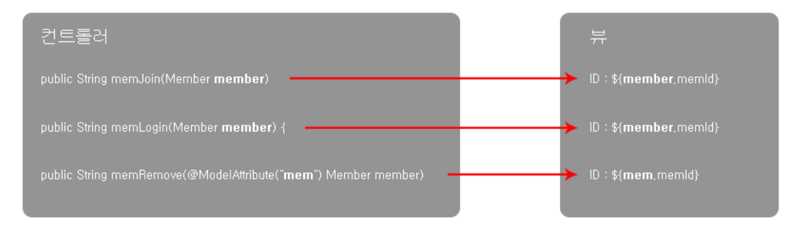

# Controller 객체 구현

**com.jw.lec18.member.controller 패키지**의 **Controller 객체**

## URL 매핑 - `@RequestMapping`

```java
@Controller
@RequestMapping("/member")
public class MemberController {
    
    @Autowired
    MemberService service;
    
    @ResourceMapping(value-"/memJoin", method=RequestMethod.POST)
    public String memJoin(Model model, HttpServletRequest request) {
        String memId = request.getParameter("memId");
        String memPw = request.getParameter("memPw");
        String memMail = request.getParameter("memMail");
        String memPhone1 = request.getParameter("memPhone1");
        String memPhone2 = request.getParameter("memPhone2");
        String memPhone3 = request.getParameter("memPhone3");
        
        service.memberRegister(memId, memPw, memMail, memPhone1, memPhone2, memPhone3);
        
        model.addAttribute("memId", memId);
        model.addAttribute("memPw", memPw);
        model.addAttribute("memMail", memMail);
        model.addAttribute("memPhone", memPhone1 + " - " + memPhone2 + " - " + memPhone3);
        
        return "memJoinOK";
    }
}
```

(MemberController.java)

- @RequestMapping 클래스 안에 @RequestMapping 클래스를 만들어 계층화를 이룰 수 있다.

  - **member/memberJoin**

    ```java
    @RequestMapping("/member")
    public class MemberController {
        @RequestMapping("/memJoin")
        public String memJoin() {}
    }
    ```


## 파라미터 처리 - `요청 파라미터`

HTTP 전송 정보를 얻는 방법은 다음과 같이 여러가지가 있다.


### HTTP 전송

1. HTML 파일

```html
<input type="text" name="memID">
<input type="password" name="memPW">
```

2. HTTP 전송 (여기선 POST)


### 방법1. HttpServletRequest 이용

3. **HttpServletRequest Class**를 이용해 <u>Request 정보 전체를 파라미터로 받기</u>

```java
@RequestMapping(value="/memLogin", method=RequestMethod.POST)
public String memLogin(Model model, HttpServletRequest request) {
    ...
}
```

4. HttpServletRequest 클래스로 받은 파라미터 객체에서 Getter를 이용해 개별 정보 출력

```java
@RequestMapping(value="/memLogin", method=RequestMethod.POST)
public String memLogin(Model model, HttpServletRequest request) {
    
    String memID = request.getParameter("memID");
    String memPW = request.getParameter("memPW");
    
}
```


### 방법2. @RequestParam 이용

3. **@RequestParam 어노테이션**을 객체에 붙여 <u>Request 정보를 개별적인 파라미터로 받기</u>

```java
@RequestMapping(value="/memLogin", method=RequestMethod.POST)
public String memLogin(Model model, @RequestParam("memID") String memID, @RequestParam("memPW") String memPW) {
    ...
}
```

- @RequestParam(..., require=false) : 값이 넘어오지 않아도 Exception 발생 X
- @RequestParam(..., defaultValue="") : 값이 넘어오지 않았을 때 들어가는 값


### 방법3. 커멘드 객체 이용 * 가장 많이 사용하는 방법

3. 데이터를 받기 위한 전용 Class를 따로 만들어 준다.

```java
public class Member {
    private String memID;
    private String memPW;
    
    public String getMemID() {
        return memID;
    }
    public void setMemID(String memID) {
        this.memID = memID;
    }
    public String getMemPW() {
        return memPW;
    }
    public void setMemID(String memPW) {
        this.memPW = memPW;
    }
}
```

(Member.java 안에 만든 Member 클래스)

4. Request 정보를 member 객체에 저장, 이후 Getter를 이용해 Data 출력

```java
@RequestMapping(value="/memLogin", method=RequestMethod.POST)
public String memLogin(Member member) {
    ...
}
```

(MemberController.java)


## @ModelAttribute

`@ModelAttribute`를 이용해 **커맨드 객체의 이름**을 변경, **View**에서 <u>커맨드 객체를 참조할 때</u> 변경된 이름을 사용 가능




## 데이터 타입

> 커맨드 객체의 데이터 타입

```html
<input type="text" name="memId">
<input type="password" name="memPw">
<input type="text" name="memAge" size="4" value="0">
```

이런 input data를 받았을 때

```java
private String memId;
private String memPw;
private int memAge;
```

이렇게 원하는 데이터 타입으로 저장 가능


### 여러 input을 하나의 커맨드 객체에 저장할 때

```html
PHONE1 : 
<input type="text" name="memPhones[0].memPhone1" size="5">
<input type="text" name="memPhones[0].memPhone2" size="5">
<input type="text" name="memPhones[0].memPhone3" size="5">

PHONE2 : 
<input type="text" name="memPhones[1].memPhone1" size="5">
<input type="text" name="memPhones[1].memPhone2" size="5">
<input type="text" name="memPhones[1].memPhone3" size="5">
```

이런 여러 input 데이터를 받고

```java
private List<MemPhone> memPhones;
```

이렇게 하나의 클래스에 저장 가능


- **memPhone1** + **memPhone2** + **memPhone3** => `memPhone` 클래스
- **memPhone** + **memPhone** => `List<memPhone> memPhones` ; memPhone이 모인 List, memPhones


## Model & ModelAndView

`Model & ModelAndView` : <u>View에 데이터를 전달</u>하기 위한 **Controller에서 사용되는 객체**

- `Model` : **데이터만** 전달
- `ModelAndView` : **데이터와 뷰의 이름**을 함께 전달


- **memModifyOk.jsp**라는 View에서 **${memBef.memId}**, **${memAft.memId}**라는 이름으로 데이터를 사용하기 위한 `Model`과 `ModelAndView` 코드

```java
// Model
@RequestMapping(value = "/memModify", method = RequestMethod.POST)
public String memModify(Model model, Member member) {
    Member[] members = service.memberModify(member);
    
    model.addAttribute("memBef", members[0]);
    model.addAttribute("memAft", members[1]);
    
    return "memModifyOk";
}
```

(model)

```java
// ModelAndView
@RequestMapping(value = "/memModify", method = RequestMethod.POST)
public ModelAndView memModify(Member member) {
	Member[] members = service.memberModify(member);
    
    ModelAndView mav = new ModelAndView();
    mav.addObject("memBef", members[0]);
    mav.addObject("memAft", members[1]);
    
    mav.setViewName("memModifyOk");
    
    return mav;
}
```


## 출처

인프런 - 자바 스프링 프레임워크(renew ver.) - 신입 프로그래머를 위한 강좌

