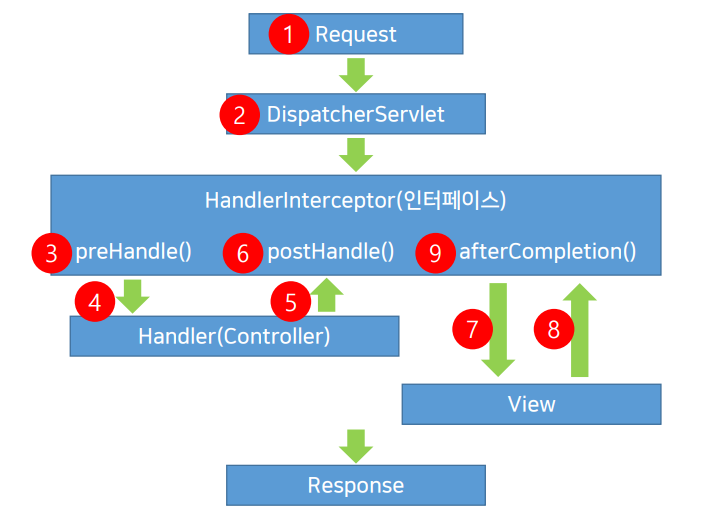

# 리다이렉트 & 인터셉트

**리다이렉트** : View를 분기하는 방법

**인터셉트** : Controller 실행 전/후 특정 작업을 설정하는 방법

## 리다이렉트

>  현재 페이지에서 특정 페이지로 전환하는 기능

`return "redirect:주소";` 형태로 사용

```java
@RequestMapping(value="/modifyForm")
public String modifyForm(Model model, HttpServletRequest request) {
    
    HttpSession session = request.getSession();
    Member member = (Member) session.getAttribute("member");
    
    if (member == null)
    	return "redirect:/"";    

    model.addAttribute("member", service.memberSearch(memver));
    
    return "/member/modifyform";
}
```


## 인터셉트

로그인이 되어야만 할 수 있는 회원 전용 서비스들 => redirect가 굉장히 많음(중복 ↑) => Controller 전 후로 데이터를 가로채서 확인 (중복을 줄임)



DispatcherServlet 과 Controller 사이에 Interceptor가 존재

- preHandle() : Controller 전 **\*가장 많이 쓰임 (redirect 대체)**
- postHandle() : Controller 후
- afterCompletion() : View까지 작업 후

```java
// 인터셉트를 위한 클래스를 새로 만듦
public class MemberLoginInterceptor extends HandlerInterceptorAdapter {
    
    @Override
    public boolean perHandle(HttpServletRequest request, HttpServletResponse response, Object Handler) throws Exception {
        
        HttpSession Session = request.getSessiont(false);
        if (session != null) {
            Object obj = session.getAttribute("member");
            if (obj != null)
                	return true
        }
        
        response.sendRedirect(request.getContextPath() + "/");
        return false;
            
    }
    
}
```


스프링 설정 파일에 Interceptor를 등록해서 관리해야 함

```xml
<interceptors>
	<interceptor>
    	<mapping path="/member/modifyForm"/>
        <mapping path="/memver/removeForm"/>
        <beans:bean class="com.jw.lec21.member.MemberLoginInterceptor"/>
    </interceptor>
</interceptors>
```

bean을 등록하고, 인터셉터가 적용되는 범위를 mapping 시켜야 함 (어떤 경로에서 인터셉터를 동작 시킬지 선언)


## 출처

인프런 - 자바 스프링 프레임워크(renew ver.) - 신입 프로그래머를 위한 강좌
